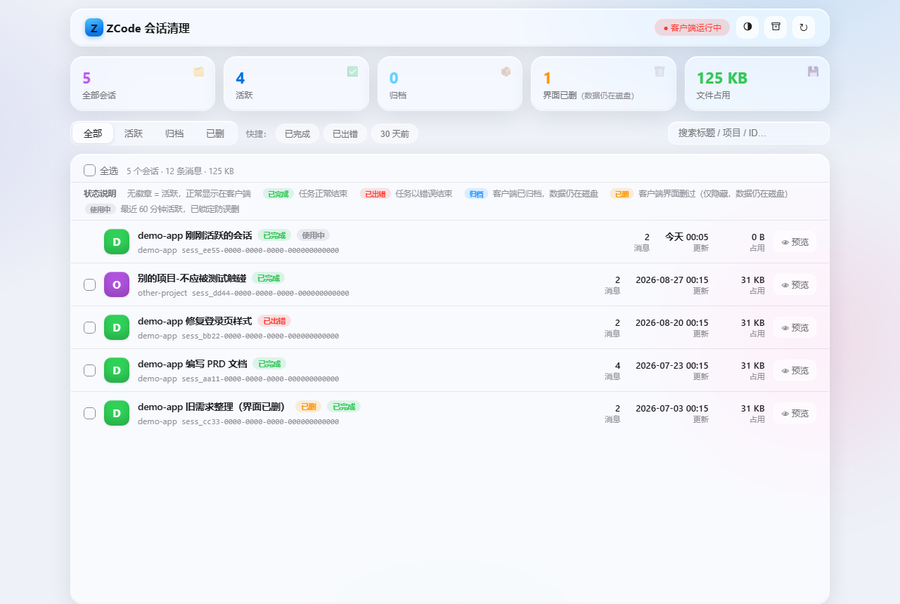
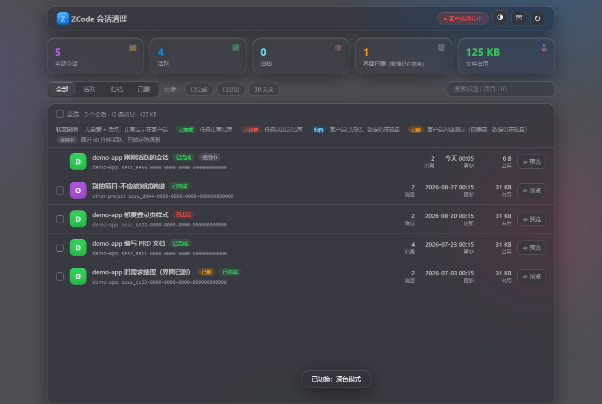

# zcode-task-cleaner

ZCode 客户端界面上的「删除」是软删除：只是打个标记把任务藏起来，聊天记录、命令日志、模型交互数据都还留在磁盘上，时间长了能占好几个 GB。这个工具直接操作底层的 SQLite 数据库和文件，把数据真正删掉。

提供 CLI 和 GUI 两个入口，都只用 Python 标准库，不需要安装任何依赖。

## GUI

```bash
python gui_server.py --open    # 打开 http://127.0.0.1:8765，--open 会自动拉起浏览器
```

功能：

- 扫描全部会话（任务索引和会话库两个库合并），列出标题、项目、消息数、状态、更新时间、磁盘占用
- 删除前可以点开预览，看完整对话文本，按角色分组的气泡样式，思考过程折叠，文字可选中复制
- 按作用域（全部 / 活跃 / 归档 / 界面已删）、任务结果（已完成 / 已出错）、时间（30 天前）筛选，也可以搜索标题、项目、ID，勾选后批量删除
- 每种状态徽章的含义界面上有图例，悬停徽章和作用域按钮也有提示（比如「已删」= 客户端软删除过，数据其实还在磁盘上）
- 删除是彻底的，见下文「每个会话删除时会发生什么」；删完出报告：成功几个、删了多少条消息、释放多少空间、VACUUM 结果、日志清洗了多少处、备份在哪个时间戳
- 每次删除前自动把两个数据库（含 WAL/SHM）备份到工具目录的 `.zcode-cleaner-backup/<时间戳>/`，删错了可以从「备份与恢复」面板一键还原
- 界面有浅色 / 深色 / 跟随系统三种主题




删除时的保护措施：

- 删除前弹确认框，列清楚这次会删掉哪些会话、动哪些数据
- 检测到 ZCode.exe 正在运行时顶栏红字提示、确认框里也有警告。这种情况下恢复备份会被直接拒绝——客户端会把内存里的旧状态写回，还原等于白做，退出客户端后再恢复
- 最近 60 分钟内活跃的会话标记「使用中」，复选框锁定不让勾
- 某一条删除失败（多数是数据库被客户端锁住）不影响其他条目，失败原因写进报告，事务自动回滚
- 列表为空、扫描失败都有提示，不会闪退

## CLI

命令行版本，适合写脚本批量清理。

```bash
# 看全部会话
python zcode-task-cleaner.py list

# 先预览要删的（delete 不加 --yes 永远只是预览）
python zcode-task-cleaner.py delete --scope deleted

# 确认没问题，真删
python zcode-task-cleaner.py delete --scope deleted --yes
```

### 过滤参数（list / delete 通用）

| 参数 | 说明 |
|---|---|
| `--scope active` | 只看活跃任务（`delete` 的默认值） |
| `--scope archived` | 只看归档任务 |
| `--scope deleted` | 只看界面已删除（软删除）的任务 |
| `--scope all` | 全部（`list` 的默认值） |
| `--project <子串>` | 按项目路径过滤，不区分大小写 |
| `--task <ID>...` | 指定会话 ID，支持前缀，可多个；指定后忽略 scope |
| `--older-than <天>` | 只处理 N 天前更新的 |
| `--keep-recent <分钟>` | 跳过最近 N 分钟活跃的会话（默认 60，0 关闭） |

### delete 专用

| 参数 | 说明 |
|---|---|
| `--export <目录>` | 删除前把每个会话的完整消息导出为 JSON |
| `--purge-checkpoints` | 某项目的任务删光时，顺带删掉该项目的检查点目录 |
| `--yes` | 真正执行。不加就永远只预览 |

常用组合：

```bash
# 界面上删过的任务彻底清掉（最常见）
python zcode-task-cleaner.py delete --scope deleted --yes

# 清理某项目全部会话，先导出备份
python zcode-task-cleaner.py delete --project myapp --scope all --export ./backup --yes

# 批量清 30 天前的任务
python zcode-task-cleaner.py delete --older-than 30 --scope all --yes

# 只删一个会话，ID 支持前缀，从 list 输出里复制
python zcode-task-cleaner.py delete --task sess_7e1883d1 --yes
```

## ZCode 的会话存在哪里

工具自动发现以下位置，不用配置：

| 存储层 | 位置 | 说明 |
|---|---|---|
| 任务索引 | `<dataBaseDir>\.zcode\v2\tasks-index.sqlite` | 界面显示的任务列表；`dataBaseDir` 读自 `~/.zcode/v2/setting.json`，没改过就是 `~/.zcode` |
| 会话消息库 | `~/.zcode/cli/db/db.sqlite` | 全部会话的聊天记录，12 张关联表 |
| 会话文件 | `~/.zcode/cli/{agents,exec,artifacts}/<sess_id>` | 子智能体记录、命令输出、工具产物 |
| 模型日志 | `~/.zcode/cli/rollout/model-io-<sess_id>.jsonl` | 单个会话能到几十 MB |
| 项目检查点 | `<v2>\checkpoints\<hash>\` | 按项目组织，看目录里 `state.json` 的 `workspacePath` 判断归属 |

三种任务状态和数据的真实关系：

| 状态 | 界面表现 | 数据还在吗 |
|---|---|---|
| 活跃 | 正常显示 | 在 |
| 归档 | 收进归档区，可能看不到 | 在 |
| 界面已删除 | 永久隐藏 | **还在**（软删除标记） |

## 每个会话删除时会发生什么

1. 自动备份两个数据库到 `.zcode-cleaner-backup/<时间戳>/`（GUI；CLI 用 `--export` 导出消息 JSON）
2. 从 `db.sqlite` 删掉该会话在 12 张关联表里的全部记录（短事务，失败自动回滚）
3. 从 `tasks-index.sqlite` 删任务记录和分组关联
4. 删 `agents\`、`exec\`、`artifacts\`、`debug\` 下的同名文件和 `rollout\model-io-<sess_id>.jsonl`
5. WAL checkpoint + VACUUM，让 `db.sqlite` 文件立刻缩小
6. 把各文本日志（`cli/log`、`v2/logs`）里的会话 ID 替换掉，会话级的日志文件整个删除
7. 项目任务清零且勾了「清理检查点」时，删对应检查点目录

不会动的数据：项目记忆（`~/.zcode/cli/memories/`）、客户端设置、正在使用的会话。

## 注意事项（实测经验）

1. 删完建议重启客户端。任务列表缓存在内存里，不重启界面上可能还显示已删任务；个别情况下（比如改存储路径触发迁移）客户端会把旧状态整体写回，数据「复活」，重跑一遍删除就行。
2. 客户端开着也能删。数据库是 WAL 模式，支持并发短事务；偶尔报 `database is locked` 是锁竞争，关掉客户端重跑即可，失败的事务自动回滚，不会损坏数据。
3. 恢复备份要求客户端完全退出，原因见上文 GUI 一节。
4. 硬删除不可恢复——唯一的后悔药是删除前的自动备份（GUI）或 `--export` 导出（CLI）。大清理之前先看一眼预览。
5. 界面上看不到不等于已删除。任务列表只展示最近活跃的部分，判断真实状态以扫描结果为准。

## 项目结构与测试

```
zcode-task-cleaner.py    CLI
gui_server.py            GUI 后端，标准库 HTTP 服务
gui/                     GUI 前端，三个文件，零依赖零构建
tests/make_fixture.py    生成测试沙箱（.test-env/ 下伪造一套完整数据）
tests/gui_test.py        GUI 自动化测试（Playwright，50 项断言，跑在沙箱上）
tests/real_env_test.py   真实环境冒烟（只读扫描 + 对脚本里配置的授权项目删一次）
docs/                    README 用的截图
```

GUI 后端没有复制删除逻辑，而是用 `importlib` 加载 `zcode-task-cleaner.py`，直接复用它的 `hard_delete`、`find_v2_dir` 等函数，所以 CLI 和 GUI 的删除行为永远一致。服务只监听 127.0.0.1。

跑自动化测试（需要 `pip install playwright`）：

```bash
python tests/make_fixture.py
ZCODE_HOME=<repo>/.test-env/home python gui_server.py --port 8977 &
python tests/gui_test.py
```

`ZCODE_HOME` 会把整个 `~/.zcode` 重定向到沙箱目录，专门给测试用，正常使用不需要设。沙箱模式下备份也生成在沙箱里，测试数据不会混进真实备份目录。

`tests/real_env_test.py` 连的是真实数据，只做只读验证，外加一次真实删除（删除前自动备份）。运行前要先在脚本顶部配置授权项目和目标会话，配置没改脚本会直接退出。

## 免责声明

这个工具直接改 ZCode 的本地数据库和文件，删了就没了。删之前看清楚预览，备份目录别乱清。和 ZCode 官方没有关系，存储结构是按实测版本写的，客户端更新后如果结构变了需要跟着改。
